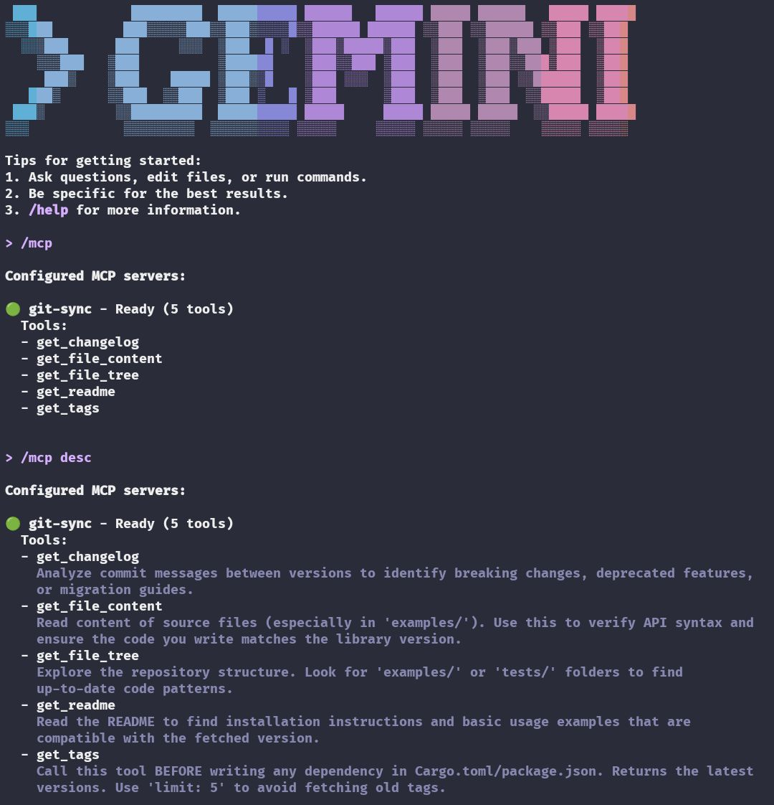
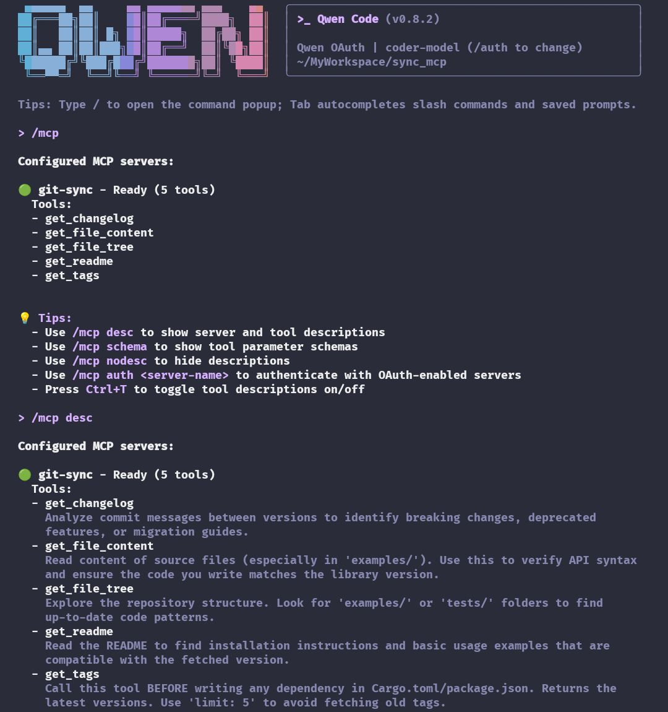
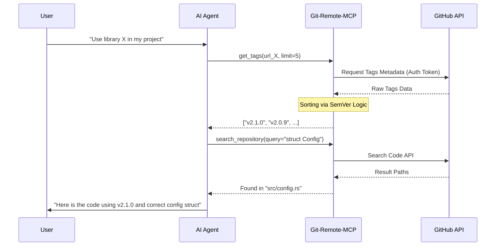

# Git MCP Rust

[](https://www.rust-lang.org/)
[](https://github.com/HanSoBored/git-mcp-rs/actions)
[](https://modelcontextprotocol.io/)
[](https://github.com/HanSoBored/git-mcp-rs/releases)
[](LICENSE)

---

**Git Remote MCP** is a high-performance Model Context Protocol (MCP) server written in Rust. It empowers AI Agents (Claude Desktop, Gemini CLI, Cursor, Qwen) to explore, search, and analyze GitHub repositories in **real-time** without the need for local cloning.

### The Problem It Solves
AI models often suffer from a "knowledge cutoff" or hallucinate library versions. This tool provides **Real-Time Context**:
- **Outdated Dependencies:** AI can fetch the absolute latest SemVer-sorted tags to recommend up-to-date libraries.
- **Context Gap:** AI can "read" remote source code, file structures, and documentation to understand libraries it wasn't trained on.
- **Blind Coding:** Instead of guessing APIs, the AI can search and read the actual implementation in the repository.

| Gemini CLI in Action | Qwen CLI in Action |
|:--------------------:|:------------------:|
|  |  |

---

## Features

- **Zero-Clone Exploration:** Fetch trees, files, and metadata via GitHub API instantly.
- **Smart Dependency Solving**: Fetches and sorts tags by **Semantic Versioning (SemVer)**, ensuring the AI suggests the *actual* latest version, not just the alphabetically last one.
- **Semantic Search:** Find functions, structs, or text across the entire repository using GitHub's Search API.
- **Secure & Scalable**: Natively supports `GITHUB_TOKEN` authentication to increase API rate limits from 60 to **5,000 requests/hour**.
- **Multi-Arch Support**: Native binaries for `x86_64`, `aarch64` (ARM64), and `armv7`.

---

## Tools Available for AI

| Tool | Description |
|------|-------------|
| `get_tags` | Returns latest tags/versions. Supports `limit` and **SemVer sorting** (e.g., `v1.10` > `v1.9`). |
| `search_repository` | Search for code, specific functions, or text definitions within the repo. |
| `get_file_tree` | Recursively lists files to reveal project architecture/structure. |
| `get_file_content` | Reads the raw content of specific files from any branch/tag. |
| `get_readme` | Automatically fetches the default README for a quick project overview. |
| `get_changelog` | Compares two tags and returns a summary of commit messages. |

---

## Example Workflows

Here is how **Git Remote MCP** bridges the gap between an AI's outdated knowledge and the current state of a repository.

### 1. Solving the "Outdated Dependency" Problem
**Scenario:** A user wants to use the `clap` library in Rust, but the AI only remembers version `v3.0` (deprecated API).

*   **User Prompt:** "Create a Rust CLI using `clap` to parse an `--input` argument."
*   **AI Internal Workflow:**
    1.  **Identify:** The AI realizes it needs the latest `clap` version.
    2.  **Verify:** Calls `get_tags(url="https://github.com/clap-rs/clap", limit=5)`.
    3.  **Receive:** Gets `["v4.5.59", "v4.5.58", ...]`.
    4.  **Action:** The AI uses the confirmed `v4.5.59` version.
*   **Result:** The AI generates code using the modern `derive` API instead of the deprecated builder pattern.

### 2. Remote Code Analysis & Search
**Scenario:** You want to understand how a project handles a specific logic without downloading 500MB of source code.

*   **User Prompt:** "How does `Zygisk-Loader` handle the `dlopen` hook?"
*   **AI Internal Workflow:**
    1.  **Explore:** Calls `get_file_tree` to see the folder structure.
    2.  **Search:** Calls `search_repository(query="dlopen", url="...")` to find the exact file and line number.
    3.  **Read:** Calls `get_file_content(path="src/main.cpp", url="...")` to read the logic.
*   **Result:** The AI explains the exact C++ logic used for the hook based on the actual file content.

---

## Visualizing the Data Flow



---

## Installation

### Option A: Quick Install (Binary)
Install the pre-compiled binary for your OS and Architecture (`Linux x86_64/aarch64/armv7` or `macOS Intel/Silicon`):

```bash
curl -fsSL https://raw.githubusercontent.com/HanSoBored/git-mcp-rs/main/install.sh | bash
```

### Option B: Build from Source (Rust)
If you have Rust/Cargo installed:

```bash
git clone https://github.com/HanSoBored/git-mcp-rs.git
cd git-mcp-rs
./build.sh
*The `build.sh` script compiles the release and moves it to `/usr/local/bin/` automatically.*
```

---

## Configuration

To use this with your MCP Client (Gemini CLI, Claude Desktop, etc.), add the following configuration.

**Crucial:** Adding a `GITHUB_TOKEN` is highly recommended to avoid the 60 requests/hour limit.

```json
{
  "mcpServers": {
    "git-remote": {
      "command": "git_mcp",
      "args": [],
      "env": {
        "GITHUB_TOKEN": "ghp_your_personal_access_token_here"
      }
    }
  }
}
```

---

## System Prompt for AI Agents

To maximize the utility of this MCP, add this to your Agent's system instructions:

```text
You are equipped with the 'git-remote' MCP toolset.
1. When asked about a library/dependency, ALWAYS use 'get_tags' with 'limit: 5' to verify the latest version. Do not guess.
2. Before suggesting implementation details, use 'search_repository' to find relevant code definitions (structs, functions).
3. Use 'get_file_content' to read the actual code context before answering.
4. If a user asks about a project structure, use 'get_file_tree'.
```

## License
MIT License. Feel free to use and contribute!