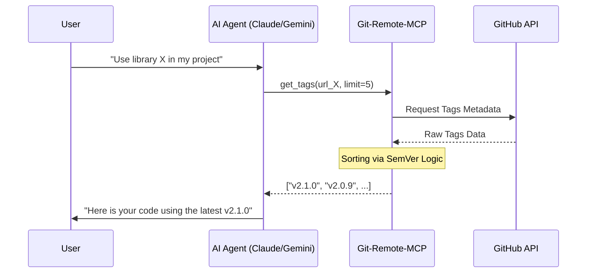

# Git MCP Rust

[](https://www.rust-lang.org/)
[](https://github.com/HanSoBored/git-mcp-rs/actions)
[](https://modelcontextprotocol.io/)
[](https://github.com/HanSoBored/git-mcp-rs/releases)
[](LICENSE)

---

**Git MCP Rust** is a high-performance Model Context Protocol (MCP) server that empowers AI Agents (Claude, Gemini, Cursor) to explore GitHub repositories in real-time without local cloning. 

### The Problem It Solves
AI models often have a "knowledge cutoff" and hallucinate library versions. This tool provides **Real-Time Context**:
- **Outdated Dependencies:** AI can now fetch the absolute latest SemVer-sorted tags.
- **Context Gap:** AI can "read" remote source code and file structures to understand libraries it wasn't trained on.


| Gemini CLI in Action | Qwen CLI in Action |
|:--------------------:|:------------------:|
|  |  |

---

## Features

- **Zero-Clone Exploration:** Fetch trees, files, and metadata via GitHub API.
- **Smart Dependency Solving**: Fetches and sorts tags by **Semantic Versioning (SemVer)**, allowing AI to always use the latest library versions.
- **Secure & Rate-Limit Ready**: Natively supports `GITHUB_TOKEN` to increase API rate limits from 60 to 5,000 requests/hour.
- **Multi-Arch Support:** Native binaries for `x86_64`, `aarch64` (ARM64), and `armv7`.

## Tools Available for AI

| Tool | Description |
|------|-------------|
| `get_tags` | Returns latest tags/versions (supports `limit` & SemVer sorting). |
| `get_file_tree` | Recursively lists files to reveal project architecture. |
| `get_file_content` | Reads raw content of specific files from any branch/tag. |
| `get_readme` | Fetches the default README for quick project overview. |
| `get_changelog` | Compares two tags and returns a commit summary. |

---

## Example Workflows

Here is how **Git Remote MCP** bridges the gap between an AI's outdated knowledge and the current state of a repository.

### 1. Solving the "Outdated Dependency" Problem
**Scenario:** A user wants to use the `clap` library in Rust, but the AI only knows about version `v3.0` (which has a different API than the current `v4.5`).

*   **User Prompt:** "Create a Rust CLI using `clap` to parse an `--input` argument."
*   **AI Internal Workflow:**
    1.  **Identify:** The AI realizes it needs the latest `clap` version.
    2.  **Verify:** Calls `get_tags(url="https://github.com/clap-rs/clap", limit=5)`.
    3.  **Receive:** Gets `["v4.5.59", "v4.5.58", ...]`.
    4.  **Action:** The AI reads the latest docs or simply uses the confirmed `v4.5.59` version.
*   **Result:** The AI provides code using the modern `derive` API instead of the deprecated v3 builder pattern.

### 2. Remote Code Analysis (Without Cloning)
**Scenario:** You want to understand a specific logic in a massive repository without downloading it.

*   **User Prompt:** "How does the `Zygisk-Loader` project handle library injection?"
*   **AI Internal Workflow:**
    1.  **Explore:** Calls `get_file_tree(url="...")` to see the source structure.
    2.  **Search:** Calls `search_repository(query="dlopen", url="...")` to find the injection point.
    3.  **Read:** Calls `get_file_content(path="src/main.cpp", url="...")` to read the actual logic.
*   **Result:** The AI explains the exact C++ logic and function calls used for injection.

### 3. Reviewing Version Changes
**Scenario:** You need to know what changed between two versions of a library to decide if you should upgrade.

*   **User Prompt:** "What are the key changes in this tool between `v1.0.0` and `v1.2.0`?"
*   **AI Internal Workflow:**
    1.  **Fetch:** Calls `get_changelog(start_tag="v1.0.0", end_tag="v1.2.0", url="...")`.
    2.  **Analyze:** Summarizes the commit messages returned by the MCP.
*   **Result:** The AI lists the new features, bug fixes, and breaking changes accurately.


## Visualizing the Data Flow



---

## Installation

### Quick Install (One-Liner)
Install the pre-compiled binary for your OS and Architecture (`Linux x86_64/aarch64/armv7` or `macOS Intel/Silicon`):

```bash
curl -fsSL https://raw.githubusercontent.com/HanSoBored/git-mcp-rs/main/install.sh | bash
```

### Build from Source (Developers)
Requires Rust and Cargo:

```bash
git clone https://github.com/HanSoBored/git-mcp-rs.git
cd git-mcp-rs
./build.sh
```
*The `build.sh` script compiles the release and moves it to `/usr/local/bin/` automatically.*

## Configuration

Add this to your MCP settings (e.g., `Gemini Cli` / `Qwen Code` config):

```settings.json
{
  "mcpServers": {
    "git-remote": {
      "command": "git_mcp",
      "env": {
        "GITHUB_TOKEN": "your_personal_access_token_here"
      }
    }
  }
}
```
> **Note:** Providing a `GITHUB_TOKEN` increases your rate limit from 60 to 5,000 requests per hour.

---

## System Prompt for AI Agents
To maximize the utility of this MCP, add this to your Agent's instructions:

```text
- When asked about a library/dependency, ALWAYS use 'get_tags' with a limit of 5 to verify the latest version.
- Before suggesting code changes, use 'get_file_tree' and 'get_file_content' to understand the target repository's structure and existing logic.
- Do not guess file paths; use 'search_repository' to find definitions.
```

## 📄 License
MIT License. Feel free to use and contribute!